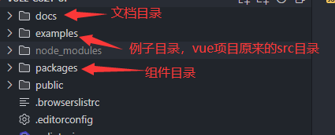
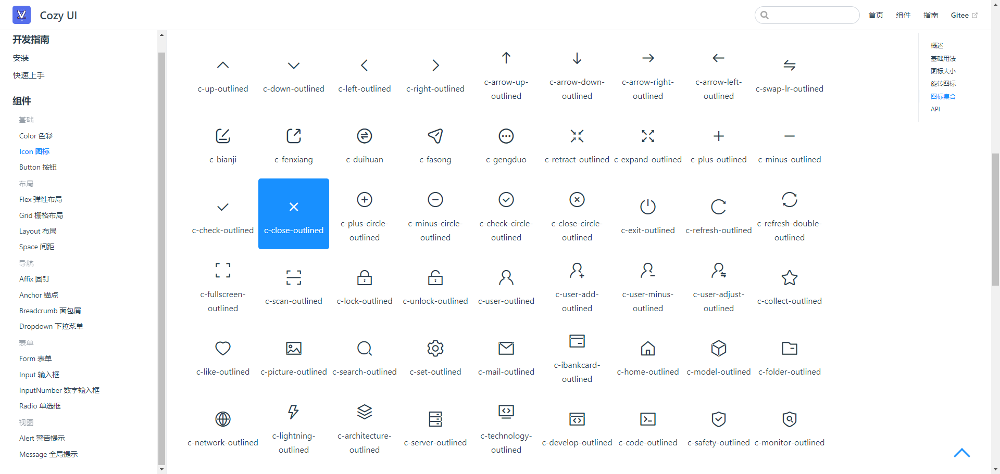

# vue2-cozy-ui

vue2-cozy-ui 用于 Vue 2 的轻量级 UI 组件库

# 运行项目
安装依赖

```bash
npm install

```
运行文档项目

```bash
npm run docs:dev

```

### 灵活性和可定制性

提供多样化组件，并支持用户自定义与扩展，以满足各种项目需求，使其具备灵活性和可扩展性。

### 响应式设计

所有组件均经过响应式设计，能够适应不同设备及屏幕尺寸，确保用户在任何环境下都能够获得良好的视觉和交互体验。

### 简洁易用的

组件库设计了简洁明了的 API，使得组件的使用变得更加容易和直观，开发人员能够更加高效地构建出所需的用户界面。

# 项目目录结构



# 项目演示



